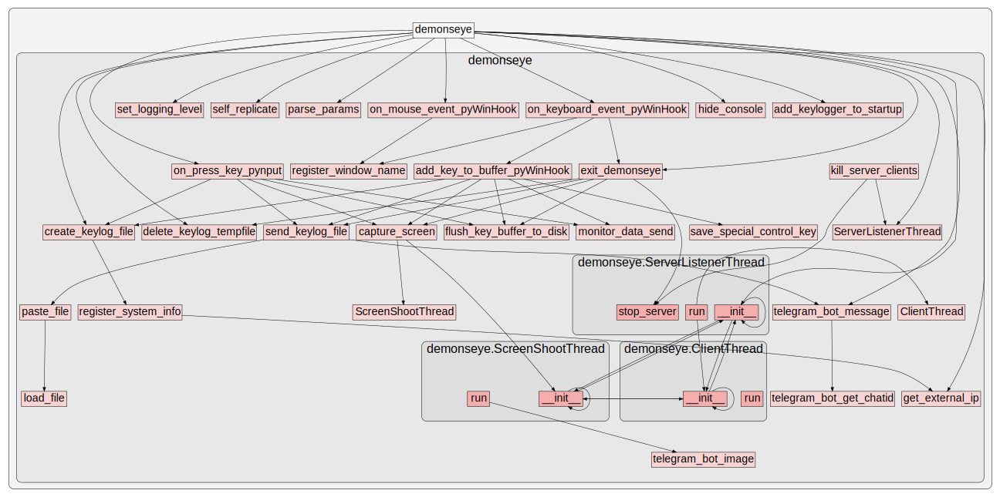

# Demon's Eye Keylogger

     ____                             _       _____             _  __          _                             
    |  _ \  ___ _ __ ___   ___  _ __ ( )___  | ____|   _  ___  | |/ /___ _   _| | ___   __ _  __ _  ___ _ __ 
    | | | |/ _ \ '_ ` _ \ / _ \| '_ \|// __| |  _|| | | |/ _ \ | ' // _ \ | | | |/ _ \ / _` |/ _` |/ _ \ '__|
    | |_| |  __/ | | | | | (_) | | | | \__ \ | |__| |_| |  __/ | . \  __/ |_| | | (_) | (_| | (_| |  __/ |   
    |____/ \___|_| |_| |_|\___/|_| |_| |___/ |_____\__, |\___| |_|\_\___|\__, |_|\___/ \__, |\__, |\___|_|   
                                                   |___/                 |___/         |___/ |___/           

## What is this?
Keylogger proof of concept for the [**TFM of the La Salle MCS (2019)**](https://www.salleurl.edu/es/estudios/master-en-ciberseguridad).

This code is part of the Final Project of the Master in Cybersecurity (2019) by Gabriel Martí Fuentes. The Master is taught at the University of La Salle - Ramon Llull.

The **TFM** document can be found at the following [URL](https://github.com/gabimarti/TFM-Analisis-Keyloggers-Ingenieria-Inversa)

## About the code and sources
For the elaboration of this code, multiple sources have been consulted, including some codes already existing in GitHub, but it is not the branch of any of them. It is prepared from scratch from the ideas and observed code of the other projects.

In the section "Useful references" I mention the most important sources of code and other possible sources of information.

If you have any questions, interest in clarifying anything about the project, or contributing ideas, you can contact me at the following address: gabimarti + github at gmail dot com

## About the name
Why "**Demon's Eye**"? ...and why not? :)

Well, the truth is that everyone knows that computer scientists and those who are passionate about technology have a balance between paranoid, weird and freaky, and that when we name something it also makes some sense (and relationships with something).

In this case, the fact of being able to see what another person writes is something diabolical (and malicious, why not say it). So this name is just what it deserves. 

But, in addition, it is the title of a [**Deep Purple** song](https://www.youtube.com/watch?v=ZwdVcMrYUrA) (which is a group that I like), and this becomes the second reason.

The same is explained in the FAQ.

## Features     
    * Record keystrokes 
    * Periodic screen capture
    * Server included for remote monitoring on the same local network.
    * Server runs in a separate thread.
    * Send data to a remote computer with Monitor App (only keystrokes) 
    * Paste data (keystrokes) to a Paste service (pastebin.com, pastecode.xyz)
    * Send data to a Telegram Channel with a Telegram Bot. (send url of Pastes and screenshots)
    * Two methods of keystroke capture using different modules (pyWinHook & pynput)
                 

## Some useful references
    * Radium Keylogger https://github.com/mehulj94/Radium-Keylogger
    * Xenotix Python Keylogger https://github.com/ajinabraham/Xenotix-Python-Keylogger
    * PyLoggy https://github.com/D4Vinci/PyLoggy
    * PyLogger https://github.com/pmsosa/pylogger

## Functions call graph

 

## License
Please read [LICENSE NOTE](https://github.com/gabimarti/Demons-eye-keylogger/blob/master/LICENSE)

You are free to use this work or the information here, but be polite and cite the source. Thank you.

    
## Final Notes
This code has been tested, developed and designed to work in a Windows environment.
**Its purpose is only educational.**

You can be critical with my code.
I hardly knew anything about Python before starting this project, so any constructive comment would be welcome.

But don't be cruel. :)

    
## Versions 
-   0.0.1 First version. Private. 
    Started on 19/may/2019
    Finished on 04/sep/2019

-   0.0.2 Second version. Minor updates and corrections. 08/sep/2019

## Known issues 

-   Special accents keys are not detected correctly and two accents appear in a row when 
    trying to accent a letter when using **pyWinHook**. To solve this use **pynput** mode.

## Disclaimer

I will not be responsible for the irresponsible use of this project. 
**ONLY this should be used for educational purposes.**
     
     
## Contact
- Follow me on Twitter [@gmarti](https://twitter.com/gmarti)
- email gabimarti (at) gmail (dot) com
 
        
    
           

